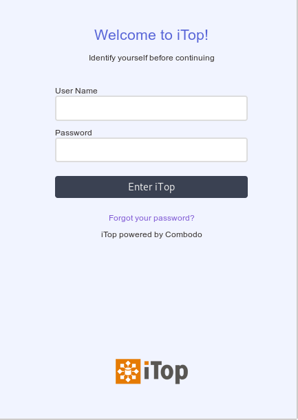

# Sample login custom css

This extension is a preview of what is achievable through our new login page (iTop >= 2.7)
If you use
```
iTop 2.7 or 3.0, use version 0.1.0
iTop 3.1 or newer, use version 0.2.0
```


It features :
* A custom css to customize login screen page
* A background image that can be replaced for branding purpose (shipped image belongs to KDE's Plasma)
* A responsive design for smaller devices

